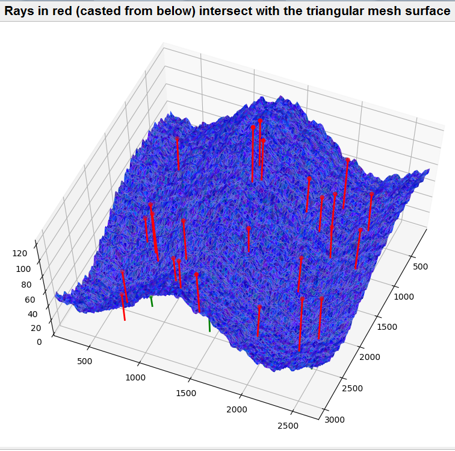

# GPU implementation of a ray-surface intersection algorithm in CUDA

This repository provides an open-source, GPU-based implementation of a ray-surface intersection algorithm in CUDA. The basic problem it solves is that given a set of rays (line segments) and a triangular mesh surface, it identifies the rays that cross the surface. For our use case, we are primarily interested in knowing whether an intersection has occured. However, the program can be configured to return the intersecting point and triangle for each intersecting ray. In our application, ray segments can point in arbitrary directions and do not originate from shared light sources.

This contribution is not geared towards game development or computer graphics per se. The motivation for writing this code is to speed up the solver relative to CPU-based implementations to increase productivity in an R&D project, rather than achieving real-time rendering performance.

### Key words

Moller-Trumbore algorithm, ray-triangle intersection, linear bounding volume
hierarchy, LBVH construction, binary radix tree, BVH traversal,
bounding box collision detection, parallel computing, GPGPU, CUDA.

## Audience

- This post would offer little to experienced programmers who are already
  skilled in general-purpose GPU computing, parallel algorithms and real-time ray tracing.
- It might be of interest to people with limited CUDA programming
  experience, and perhaps researchers/engineers looking for a "ready-made"
  working implementation of a ray-surface intersection algorithm that
  runs on Nvidia GPU devices.

## Background

There are two technical components to the code. An exact algorithm for finding
ray-triangle intersections (such as the Moller-Trumbore algorithm) and
accelerating data structures (such as bounding volume hierarchy or BVH [1])
that spares us from having to evaluate bounding box collision for every
possible triangle and line-segment combination.

In regard to ray-triangle intersection tests, Jimenez et al. have analysed
half a dozen algorithms, and determined the Moller-Trumbore to be the most
efficient in a general setting. Those findings are reported in [2]. In
regard to BVH, our implementation is inspired by the approaches described
by Robbin Marcus [3] and Tero Kerras [4]. Their blog entries provide
practical guidance and the necessary background for understanding this code.
Interested readers are referred to these online resources for bridging material.

## Usage

The three supported use cases are

- <b>Standard usage (`mode=boolean`)</b>
  - This returns a boolean indicating whether or not each ray intersects with the surface.
- <b>Extended usage (`mode=barycentric`)</b>
  - This returns the intersecting triangle and nearest intersecting point
    for each surface intersecting ray.
- <b>Experimental feature (`mode=intercept_count`)</b>
  - This returns the number of unique intersections with the surface for each ray. 

The code is compiled with
<pre><code>/usr/local/cuda/bin/nvcc gpu_ray_surface_intersect.cu -o gpu_ray_surface_intersect
</code></pre>

and executed using
<pre><code>gpu_ray_surface_intersect &lt;vertices&gt; &lt;triangles&gt; &lt;rayFrom&gt; &lt;rayTo&gt; &lt;feedback&gt; &lt;mode&gt;
</code></pre>

Setting `feedback=silent` suppresses terminal output.
Command line arguments for the three use cases are described in [Section 2.3](doc/gpu-rsi-doc.pdf#subsection.2.3) and [2.4](doc/gpu-rsi-doc.pdf#subsection.2.4).

For convenience, `scripts/py_gpu_ray_surface_intersect.py` implements a wrapper
class `PyGpuRSI` that encapsulates the functionality of `gpu_ray_surface_intersect.cu`.
The notebook `scripts/demo.ipynb` shows how data manipulation, compilation, run and
clean-up steps can be managed using a `with` statement. To produce results in the
form of `(intersecting_rays, distances, intersecting_triangles, intersecting_points)`
in lieu of a `crossing_detected` binary array, please refer to Part B of `scripts/demo.ipynb`.
Example of the last use case is shown in Part C of `scripts/experimental_feature.ipynb`.

## Documentation

The [PDF document](doc/gpu-rsi-doc.pdf) provides an overall description of the
implementation and discusses issues such as collision buffer management.
The aim is to shed light on the more obscure parts of the code, and
provide some clarity on certain practical considerations that are sometimes
omitted in discussion. Compilation instruction, usage command, CPU/GPU
specifications and run time measurements are also included for reference.

> A self-contained PyCUDA implementation is also available. PyCUDA provides a Python scripting approach to GPU Run-Time Code Generation. Refer to [pycuda/README.md](https://github.com/raymondleung8/gpu-ray-surface-intersection-in-cuda/tree/main/pycuda) for more information.

## References

- [1] Wikipedia, Bounding volume hierarchy. URL https://en.wikipedia.org/wiki/Bounding_volume_hierarchy
- [2] Juan J Jiménez, Carlos J Ogáyar, José M Noguera, and Félix Paulano.
    Performance analysis for GPU-based ray-triangle algorithms. In 2014
    International Conference on Computer Graphics Theory and Applications,
    pages 1–8. IEEE, 2014.
- [3] Robbin Marcus. Real-time raytracing part 2.1. Published on 2015-10-29.
    Available at http://robbinmarcus.blogspo.com/2015/12/real-time-raytracing-part-21.html.
- [4] Tero Kerras. Thinking Parallel, Part II: Tree Traversal on the GPU.
    Published on 2012-11-26. Available at https://developer.nvidia.com/blog/thinking-parallel-part-ii-tree-traversal-gpu.

## License

>📋  This project is licensed under the terms of the [BSD 3-Clause](LICENSE.md) license.

If you find this code useful, you are welcome to cite this in your work:
- Raymond Leung, GPU implementation of a ray-surface intersection algorithm in CUDA, arXiv e-print 2209.02878, 2022.  Source code available at: https://github.com/raymondleung8/gpu-ray-surface-intersection-in-cuda under a BSD 3 license.
- The BibTeX entry may be copied from [here](doc/citation.bib).
