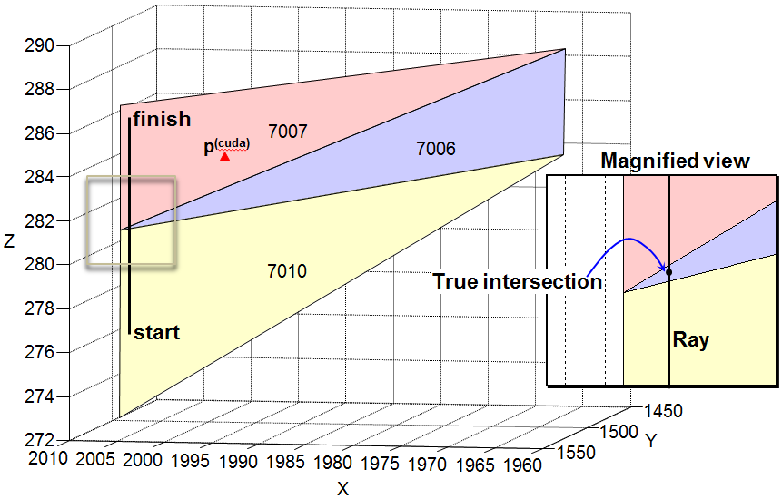

## Investigate issue reported by Stefan Trpkovski

### Synopsis
- Using `EPSILON = 1e-6` (a fixed absolute tolerance) to compare the determinant with zero is too strict. In general, the magnitude of `det` is dependent on the L2-norm of the ray direction vector `(rayTo - rayFrom)`, and the `edgeAB` and `edgeAC` vectors of a given triangle.
- Using `float32` for internal calculations, the effects of numerical rounding can accumulate. This may give rise to false or inaccurate detections of the intersecting points if amplification effects are not accounted for.

### Test data
```python
import numpy as np
triangles = np.array([[3,1,4], [3,1,0], [4,2,5], [4,1,2]], dtype=np.int32)
actual_triangle_id = {0:7006, 1:7007, 2:7009, 3:7010}
vertices = np.array([[2007.415039062,1519.457031250,286.752014160],
                     [2007.415039062,1519.457031250,281.058990479],
                     [2007.628051758,1518.286010742,272.477996826],
                     [1964.505981445,1475.868041992,288.782989502],
                     [1964.859008789,1473.921020508,283.925994873],
                     [1965.276000977,1471.619995117,274.032989502]], dtype=np.float32)
actual_ray_id = 5178245
rayFrom = np.array([[2006.452148438,1518.478881836,276.280212402]], dtype=np.float32)
rayTo = np.array([[2006.452148438,1518.478881836,286.181976318]], dtype=np.float32)
```

### Visualisation


### Issue
As of commit 6ecfbc8e057c, the CUDA program `gpu_ray_surface_intersect` reported an intersecting point, <b>p</b><sup>(cuda)</sup>, with triangle 7007 which is more than 10m away from the ray itself when `mode = "barycentric"`. In actual fact, the line segment intersects the surface only once (with the purple triangle 7006) at the location shown by the black dot.

The following python code replicates this test case.
```python
cuda_cfg = {'mode':'barycentric'}

with PyGpuRSI(GPU_CODE_DIR, WORK_DIR, quiet=True, cfg=cuda_cfg) as rsi:
    intersecting_rays, distances, hit_triangles, hit_points = \
        rsi.test(vertices, triangles, rayFrom, rayTo)

if len(intersecting_rays) > 0:
    print('intersecting_ray: {}'.format(intersecting_rays[0]))
    print('distances: {}'.format(distances[0]))
    print('hit_triangles: {}'.format(hit_triangles[0]))
    print('hit_points: {}'.format(hit_points[0]))
    print('separating distance: {}'.format(np.linalg.norm(rayFrom - hit_points[0])))
```

```
    intersecting_ray: 0
    distances: 3.3082871437072754
    hit_triangles: 1 (id=7007)
    hit_points: [1997.26123047, 1509.14221191, 284.24417114]
    separating distance: 15.332025866346207
```

### Diagnosis
Using the debugging code from the [<font color=#CC0066>`feature_issue4_diagnostic`</font>](https://github.com/acfr/gpu-ray-surface-intersection-in-cuda/compare/feature_issue4_diagnostic) branch, some numerical issues were identified within the `intersectMoller` device function (2nd form or barycentric form) in `"rsi_geometry.h"`.
- With <font color=#CC0066>`query_ray_idx`</font> set to `0`, we instruct `checkRayTriangleIntersection` (2nd form) to capture the relevant Moller-Trumbore algorithm parameters for the very first ray.

```python
# Running CUDA program in diagnostic mode
cuda_cfg = {'mode':'barycentric', 'keep_cuda_binary': True, 'query_ray_idx': 0}

with PyGpuRSI(GPU_CODE_DIR, WORK_DIR, quiet=True, cfg=cuda_cfg) as rsi:
    intersecting_rays, distances, hit_triangles, hit_points, diagnostic_info = \
        rsi.test(vertices, triangles, rayFrom, rayTo)

PyGpuRSI.decode_debug_data(diagnostic_info)
```

### Analysis
The ray interacts spatially with three triangles, 7010, 7006 and 7007. Looking at the debug information in turn, triangle 7010 is not of interest as far as ray-surface intersection is concerned.
- Since the first barycentric coordinate `u` already lies outside the [0,1] interval, the ray only crosses the plane extrapolated from the yellow triangle at a location far far away (approx. 598 times its size).
- This result is expected, as the ray is strictly parallel with the Z-axis, but the shortest edge of triangle 7010 is slightly off-vertical (although this may not be obvious from the figure).
```
    Collision candidate 0, rayidx=0, triangleID=7010
    Moller-Trumbore param:  det=589.489013671875, t=0.0
    Epsilon used: 9.999999974752427e-07
    Barycentric coords:     u=598.2424926757812, v=2.350903502697944e-38
                         => NO INTERSECTION WITH THIS TRIANGLE
    Triangle indices: [4,1,2]
    Triangle vertices [4] (1964.859008789,1473.921020508,283.925994873)
                      [1] (2007.415039062,1519.457031250,281.058990479)
                      [2] (2007.628051758,1518.286010742,272.477996826)
    Edge1 AB: (42.556030273,45.536010742,-2.867004395)
    Edge2 AC: (42.769042969,44.364990234,-11.447998047)
    Vect A: (-439.291656494,423.488952637,0.000000000)
    Vect T: (41.593139648,44.557861328,-7.645782471)
    Vect B: (0.000000000,0.000000000,0.000000000)
    Ray from: (2006.452148438,1518.478881836,276.280212402)
    Ray to:   (2006.452148438,1518.478881836,286.181976318)
    Ray length: 9.901763916015625
    Intersecting point (t method):    (2006.452148,1518.478882,276.280212)
    Intersecting point (barycentric): (27423.707031,28715.486328,-1431.231445)
```

- The second block reveals the CUDA program in fact correctly detected the true intersecting point.
- The barycentric coordinates `u=0.977559, v~=0` indicate the ray crosses triangle 7006 very close to (but just inside) one of its vertex. Furthermore, the `t=0.5` parameter indicates the intersection occurs at the midpoint of the line segment (at a distance of 4.45m as measured from the ray starting point).
- This solution was subsequently discarded because the distance to the spurious intersecting point with triangle 7007 was deemed closer to the launching point of the ray.

```
    Collision candidate 1, rayidx=0, triangleID=7006
    Moller-Trumbore param:  det=979.61083984375, t=0.5001234412193298
    Epsilon used: 9.999999974752427e-07
    Barycentric coords:     u=0.9775596857070923, v=3.15546316187465e-07
                         => INTERSECTION CORRECTLY DETECTED
    Triangle indices: [3,1,4]
    Triangle vertices [3] (1964.505981445,1475.868041992,288.782989502)
                      [1] (2007.415039062,1519.457031250,281.058990479)
                      [4] (1964.859008789,1473.921020508,283.925994873)
    Edge1 AB: (42.909057617,43.588989258,-7.723999023)
    Edge2 AC: (0.353027344,-1.947021484,-4.856994629)
    Vect A: (19.278947830,3.495593309,-0.000000000)
    Vect T: (41.946166992,42.610839844,-12.502777100)
    Vect B: (215.857315063,-212.490219116,0.000031218)
    Ray from: (2006.452148438,1518.478881836,276.280212402)
    Ray to:   (2006.452148438,1518.478881836,286.181976318)
    Ray length: 9.901763916015625
    Intersecting point (t method):    (2006.452148,1518.478882,281.232330)
    Intersecting point (barycentric): (2006.452148,1518.479004,281.232330)
```

- The third block reveals that <i>errors due to numerical rounding</i> (using single precision float32 representation) <font color=#CC0066>causes the determinant `det=0.001296` to deviate from zero</font> (its true value).
- A `det` of zero indicates the ray lies in the plane of triangle 7007. Thus, it makes no sense to inquire about its intersecting point.
- On paper, `det = dot(cross(dir,edgeAC),edgeAB)` should be zero. In practice, because the zero threshold `EPSILON = 0.000001` is set at an incredibly low bar, the rejection criterion  `det < EPSILON` (0.00129642 < 0.000001) cannot be satisfied. So, the algorithm thinks the geometry test remains valid.
- Proceeding with the calculation, the sum of the barycentric coordinates `(u + v)` fortuitously fall within the legal range `[0,1]`. Thus, the theoretical intersecting point was calculated using these precarious values.
- A telltale sign is that the <font color=#CC0066>intersecting point computed using the barycentric coordinates (u,v) diverges</font> from the estimate obtained by projecting a relative distance (t) along the line segment.

```    
    Collision candidate 2, rayidx=0, triangleID=7007
    Moller-Trumbore param:  det=0.0012964271008968353, t=0.33411088585853577
    Epsilon used: 9.999999974752427e-07
    Barycentric coords:     u=0.5249290466308594, v=0.23843422532081604
                         => SPURIOUS INTERSECTION DETECTED
    Triangle indices: [3,1,0]
    Triangle vertices [3] (1964.505981445,1475.868041992,288.782989502)
                      [1] (2007.415039062,1519.457031250,281.058990479)
                      [0] (2007.415039062,1519.457031250,286.752014160)
    Edge1 AB: (42.909057617,43.588989258,-7.723999023)
    Edge2 AC: (42.909057617,43.588989258,-2.030975342)
    Vect A: (-431.607879639,424.875366211,0.000000000)
    Vect T: (41.946166992,42.610839844,-12.502777100)
    Vect B: (215.857315063,-212.490219116,0.000031218)
    Ray from: (2006.452148438,1518.478881836,276.280212402)
    Ray to:   (2006.452148438,1518.478881836,286.181976318)
    Ray length: 9.901763916015625
    Intersecting point (t method):    (2006.452148,1518.478882,279.588501) # t-estimate
    Intersecting point (barycentric): (1997.261230,1509.142212,284.244171) #(u,v)=estimate
```

### Observation
The determinant `det` in the Moller-Trumbore algorithm scales with the magnitude of the `direction` vector `(rayTo - rayFrom)`, as well as the L2-norm of `edge1` and `edge2` of the triangle (see `intersectMoller` function). Hence, when the triangles on the mesh surface are very large, they will have an "inflationary" effect on the rounding error.
- For this test case, the length of the ray and edges in this candidate triangle are 9.9018, 61.6510 and 61.1989m, respectively. Altogether, they magnify `det` by a factor of 3736 compared with a situation [with similar Euclidean geometry] where a normalised direction vector and unit-length triangles were used.

### Solution
- Using relative tolerance, the `det` value (0.00129642) should be compared with `epsilon = EPSILON * norm(dir) * norm(edgeAB) * norm(edgeAC)`. This provides enough of a buffer and improves numerical stability. The changes are implemented in this commit.

### Validation
- Testing was conducted on a GNU/Linux x86_64 machine with 3.5GHz Intel Xeon CPU E5-1650 (x 12) and Nvidia GeForce GTX Titan X GPU, as well as a Windows 11 laptop with 2.3GHz Intel i7-11800H 8 Core processor and Nvidia GeForce RTX 3060 GPU.
- The CUDA program was run in "barycentric" and "intercept_count" mode. Results "before" and "after" the proposed changes are compared.

#### Part 1: Ensure the solution works for this test case
```python
cuda_cfg = {'mode':'barycentric', 'keep_cuda_binary': True}

with PyGpuRSI(GPU_CODE_DIR, WORK_DIR, quiet=True, cfg=cuda_cfg) as rsi:
    intersecting_rays, distances, hit_triangles, hit_points = \
        rsi.test(vertices, triangles, rayFrom, rayTo)
```

```
Results (BEFORE)
    intersecting_ray: 0
    distances: 3.8746962547302246
    hit_triangles: 1 (id=7007)
    hit_points: [1997.26123047 1509.14221191  284.24417114]

Results (AFTER)
    intersecting_ray: 0
    distances: 4.952104091644287
    hit_triangles: 0 (id=7006)
    hit_points: [2006.45214844 1518.47900391  281.23233032]
...........................................................................
    Collision candidate 0, rayidx=0, triangleID=7006
    Moller-Trumbore param:  det=979.61083984375, t=0.5001234412193298
    Epsilon used: 0.003201591083779931
    Barycentric coords:     u=0.9775596857070923, v=3.15546316187465e-07
    # INTERSECTION DETECTED
    
    Collision candidate 1, rayidx=0, triangleID=7010
    Moller-Trumbore param:  det=589.489013671875, t=0.5001234412193298
    Epsilon used: 0.03872175142168999
    Barycentric coords:     u=598.2424926757812, v=not computed
    # NO INTERSECTION. Reason: Hit point lies outside this triangle
    
    Collision candidate 2, rayidx=0, triangleID=7007
    Moller-Trumbore param:  det=0.0012964271008968353, t=0.5001234412193298
    Epsilon used: 0.03735913336277008
    Barycentric coords:     u=not computed,      v=not computed
    # NO INTERSECTION. Reason: Candidate rejected since det < epsilon
```

Similarly, in `intercept_count` mode, the original intercept count was 2 (counting both triangle 7006 and 7007). Subsequently, the count is 1 (counting only triangle 7006) as expected.
```python
cuda_cfg = {'mode':'intercept_count', 'keep_cuda_binary': True}

with PyGpuRSI(GPU_CODE_DIR, WORK_DIR, quiet=True, cfg=cuda_cfg) as rsi:
    crossings = rsi.test(vertices, triangles, rayFrom, rayTo)

print('Number of crossings = {}'.format(crossings[0]))
```

```
Results (BEFORE)
    Number of crossings = 2

Results (AFTER)
    Number of crossings = 1
```

#### Part 2: Understand its effects more broadly
To measure the incident rate and the impact of the proposed solution, the CUDA program was run on a surface with 14966 vertices, 29284 triangles and 10M rays. The simple test case presented at the beginning is actually contained in this larger dataset.

Verification code was writen in Python to return a list of rays, `L`, where the intersecting point (calculated using the (u,v) barycentric coordinates) deviate by more than some distance `delta` from the line segment. In addition, various baseline `EPSILON` values were used to demonstrate that changing `EPSILON` in the existing code alone does not offer a robust or scalable solution to the problem.

The following table shows the prevalence of the problem is < 0.01% using the existing code (even with a tolerance `delta` of 1mm). We can also confirm the problematic ray (5178245) we looked at previously is contained in the list `L`. Using the proposed solution, fewer than 50 (0.0005%) of the reported ray-surface intersections deviate by more than 1cm from the line segments when `EPSILON = 1e-5`.

```
[EPSILON = 1e-6]
                    BEFORE                      AFTER
deviation >= 0.001: 725 instances (0.007250%)   719 instances (0.00719%)
deviation >= 0.005: 258 instances (0.002580%)   252 instances (0.00252%)
deviation >= 0.01:  205 instances (0.002050%)   199 instances (0.00199%)
deviation >= 0.05:  151 instances (0.001510%)   145 instances (0.00145%)
deviation >= 0.2:   134 instances (0.001340%)   129 instances (0.00129%)
max deviation:      13.101388                   3.563439

[EPSILON = 1e-5]
                    BEFORE                      AFTER
deviation >= 0.001:                             566 instances (0.005660%)
deviation >= 0.005:                             100 instances (0.001000%)
deviation >= 0.01:  unchanged (no improvement)  47 instances (0.000470%)
deviation >= 0.05:                              0 instances (0.000000%)
deviation >= 0.2:                               0 instances (0.000000%)
max deviation:      13.101388                   0.034523

[EPSILON = 1e-4]
                    BEFORE                      AFTER
deviation >= 0.001:                             430 instances (0.004300%)
deviation >= 0.005:                             5 instances (0.000050%)
deviation >= 0.01:  unchanged (no improvement)  0 instances (0.000470%)
deviation >= 0.05:                              0 instances (0.000000%)
deviation >= 0.2:                               0 instances (0.000000%)
max deviation:      13.101388                   0.008604
                                :
                                :
[EPSILON = 1e-2]
                    BEFORE                      AFTER
deviation >= 0.001: 719 instances (0.007250%)   1 instance (0.000010%)
deviation >= 0.005: 252 instances (0.002580%)   0 instances (0.000000%)
deviation >= 0.01:  199 instances (0.002050%)   0 instances (0.000000%)
deviation >= 0.05:  145 instances (0.001510%)   0 instances (0.000000%)
deviation >= 0.2:   129 instances (0.001340%)   0 instances (0.000000%)
max deviation:      3.563439                    0.001007
```

The distance measure we used is shown [here](measure.md)